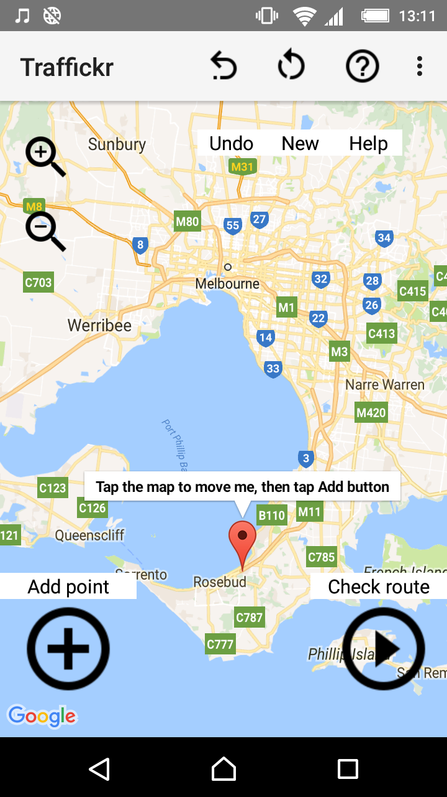
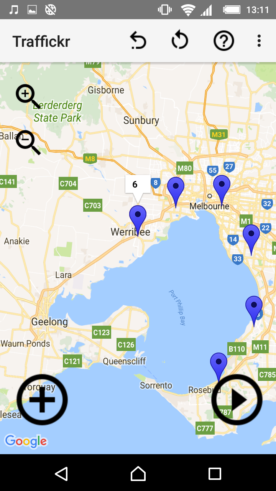
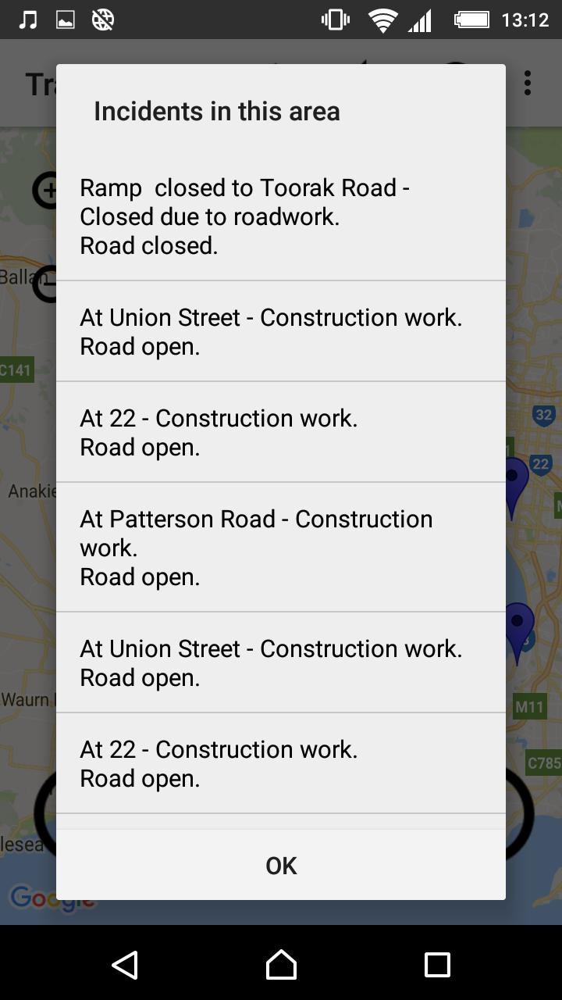

# CommutePlanner

An application that checks for traffic incidents in a user-plotted area by utilising the Google Maps and Bing Maps APIs.

Written in Java using Android Studio 2.3 for Android 5.1 and above.
  

### Build

<a href="https://github.com/kellybs1/CommutePlanner/blob/master/Builds/Commute.apk?raw=true">/Builds/Commute.apk</a>

Notes: You will need to allow installation of apps from unknown sources. Usually under Settings -> Security on Android device.

### Source

<a href="Source/Commute/app/src/main">/Source</a>

Note: API keys have been removed from source, so project will not build. For a working version of the app, download the APK above.

### Screenshots

Initial screen, with instructions, shown at every load

Plotting a route. All point are numbered, and route can be undone in reverse order, or a new route started.

Loads traffic incident data from the Bing Maps Traffic API (https://msdn.microsoft.com/en-us/library/hh441726.aspx)

### Notes
Contains bugs: An educational project only    
The area to check is calculated by find the N,E,S,W most points from the user-provided points. This can lead to anomalous results at times.
A more accurate method would be to generate a new Area between each pair of points. This method was not chosen as it would require a call to the Bing Maps API for every pair of points, which leads to concerns about the app being blocked by the API, and long wait times while loading traffic data.

